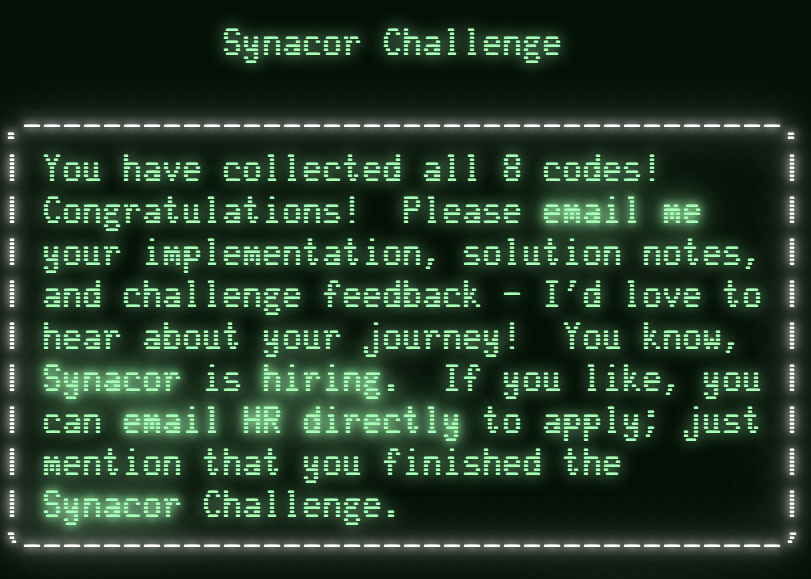

# Synacor Challenge

This repo contains my solution for the [Synacor Challenge](https://challenge.synacor.com/) including the challenge spec, all code for the VM, any additional helpers, and my rough notes created to collect all eight codes.



## Running the VM

To run the challenge binary code in the VM, make sure to have [golang](https://go.dev/dl/) installed and run `./run.sh` in the terminal.

### Running and Developing in Docker

This repo is configured to be developed in Visual Studio Code inside a remote container. The container definition will install and configure all tools needed to run this solution, including go.

See the [Visual Studio Code documentation](https://code.visualstudio.com/docs/devcontainers/containers) for more information on developing in remote containers.

### Run Modes

There are two ways to run the VM, either in manual or automated mode. To explore and play the VM game, uncomment Line 15 in [`main.go`](src/main.go#L15) and comment out Line 14.

```golang
func main() {
	// vm := createAutomatedGame(false)
	vm := createManualGame(challengeBinSrc, false)

	...
}
```

The automated game reads in the full move set from [notes/Game.md](notes/Game.md) and automates all user actions.

- [ ] TODO: Take in manual/automated argument from terminal
- [ ] Nice to Have: Allow for combined manual/automation (e.g. automate until the file ends) and make the program exit gracefully when the end of the automation file is reached.

### Debugging

#### Debug Logs

To create a debug log, pass `true` to the `debug` parameter of either the manual or automated game functions. A log file will be created in `notes/logs` with the current time stamp.

> #### **Warning**
> 
> The resulting log files are quite large and cumbersome to read through. Creating the log will slow down the execution of the VM. Only create log files when needed.
> 
> _Due to the file size, the `notes/logs` directory is ignored from source control._

- [ ] TODO: Add debug flag to terminal arguments.

#### Memory Dump

The VM provides a utility to do a full memory dump given a writer to write to. For an easy way to dump the memory before execution, uncomment lines 46-53 in [`main.go`](src/main.go#L45).

The memory dump file will have one memory value per line and will list both the code and name of any op codes, if applicable, e.g. `out (19)`.

#### Write Assembly

The VM provides a utilty to write assembly code from the current memory contents. Similar to the Memory Dump utility, the easiest way to use this function is to uncomment lines 46-53 in [`main.go`](src/main.go#L45) but call the `WriteAssembly` function instead. There is an example in a comment in this block.

The resulting assembly code will have the memory address listed on each line for ease of tracing jumps and calls and will list the op code names rather than values.

## Helper Functions

A few other functions were created to help solve parts of the challenge, most notably the coin, teleporter energy level, and orb puzzles.

That code can be found in [`src/energyLevel/energyLevelCheck.go`](src/energyLevel/energyLevelCheck.go) (teleporter energy level implementation) and [`src/helpers/helpers.go`](src/helpers/helpers.go) (coins, orb).

All three utilities can be run at once by running `go run src/helpers/helpers.go` from the root of the repository. This main function includes the energy level check, which is a brute-force algorithm and takes multiple minutes to complete.

## Notes

While most of the raw notes included in this repository are likely not very useful to other readers, they reflect my personal thoughts as I progressed through the challenge. The notes are roughly named after the starting location or item for each relevant puzzle:

* [`Foothills`](notes/Foothills.md) for the series of puzzles which begin in the foothills (tablet, cave maze, coins). The cave maze was largely completed by brute-force/trial-and-error so the notes are particularly scattered and incomplete.
* [`Teleporter`](notes/Teleporter.md) for anything to do with the teleporter puzzle. This note includes my summary of the strange book instructions as well as the full strange book text, some key lines from assembly and memory dumps that corresponded to the validation code, and some pseudocode decompiled from the assembly (re-implemented in [`energyLevelCheck.go`](src/energyLevel/energyLevelCheck.go)).
*  [`Beach`](notes/Beach.md) for the orb puzzle, which begins on the beach.

The notes folder also has a directory for log files (empty in source control due to file size), assembly and memory dumps, the full game automation steps, and files that just contain text output from the game.
